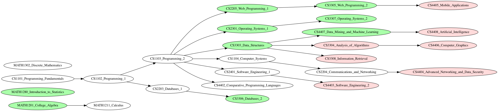
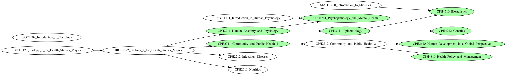

## Computer Science

[B.Sc. Computer Science Degree Curriculum | UoPeople](https://www.uopeople.edu/programs/cs/degrees/computer-science-bachelor-degree-2/curriculum/)

[Courses in Computer Science - uopeople catalog](https://catalog.uopeople.edu/ug_term1_item/computer-science/courses-in-computer-science)




## Health Science

[B.Sc. Health Science Degree Curriculum | UoPeople](https://www.uopeople.edu/programs/hs/health-studies-bachelor-degree/curriculum/)




## Note

```
$ dot -T png -o cs_curriculum.png cs_curriculum.dot
$ dot -T png -o health_curriculum.png health_curriculum.dot
```
